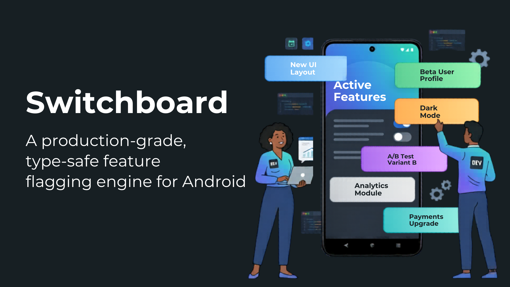

<p align="center">
  
</p>

# Switchboard 🎛️

[](https://opensource.org/licenses/Apache-2.0)
[](https://kotlinlang.org/)
[](https://github.com/google/ksp)

**Switchboard** is a production-grade, type-safe feature flagging engine for Android. It leverages Kotlin Symbol Processing (KSP) to turn simple property declarations into a powerful configuration system, complete with a reactive debug UI and network diagnostics.

---

## ✨ Features

- **🛡️ End-to-End Type Safety**: Define flags once as Kotlin properties. Access them anywhere with full compiler support—no magic strings, no manual casting.
- **📊 Real-time Debug Dashboard**: Auto-generated Jetpack Compose UI to inspect every flag's source (Remote, Local Override, or Default) and toggle overrides on the fly.
- **🤝 Plug-and-Play Backends**: First-class support for **Firebase Remote Config** with reactive update flows.
- **🏎️ Zero-Reflective Performance**: KSP generates all registry code at compile-time for maximum runtime efficiency.
- **🌐 Network Diagnostics**: Built-in **OkHttp Interceptor** that attributes every network request to the specific feature flags driving the app logic.
- **📳 Shake to Debug**: Integrated shake-to-open gesture for instant access to the debug console in non-production builds.

---

## 🛠️ Installation

Add the following to your `libs.versions.toml`:

```toml
[versions]
switchboard = "0.1.0"

[libraries]
switchboard-core = { module = "services.pixelpulse.switchboard:switchboard-core", version.ref = "switchboard" }
switchboard-android = { module = "services.pixelpulse.switchboard:switchboard-android", version.ref = "switchboard" }
switchboard-ksp = { module = "services.pixelpulse.switchboard:switchboard-ksp", version.ref = "switchboard" }
# Optional modules
switchboard-compose = { module = "services.pixelpulse.switchboard:switchboard-compose", version.ref = "switchboard" }
switchboard-shake = { module = "services.pixelpulse.switchboard:switchboard-shake", version.ref = "switchboard" }
switchboard-firebase = { module = "services.pixelpulse.switchboard:switchboard-firebase", version.ref = "switchboard" }
switchboard-okhttp = { module = "services.pixelpulse.switchboard:switchboard-okhttp", version.ref = "switchboard" }
```

Apply the KSP plugin and add dependencies in your `build.gradle.kts`:

```kotlin
plugins {
    id("com.google.devtools.ksp")
}

dependencies {
    implementation(libs.switchboard.android)
    ksp(libs.switchboard.ksp)
    
    // Add optional modules as needed
    implementation(libs.switchboard.compose)
    implementation(libs.switchboard.shake)
}
```

---

## 📖 Quick Start

### 1. Declare your Flags
Use the `@Flags` annotation on an object. Each property becomes a feature flag.

```kotlin
@Flags
object AppFlags {
    @BooleanFlag(default = false, description = "Enable the new experimental checkout flow", category = "Checkout")
    val useNewCheckout: Boolean = false

    @StringFlag(default = "Welcome!", description = "Headline for the home screen")
    val homeHeadline: String = "Welcome!"
    
    @EnumFlag(default = "CONTROL", enumClass = Variant::class)
    val experimentVariant: Variant = Variant.CONTROL
}

enum class Variant { CONTROL, TEST_A, TEST_B }
```

### 2. Initialize Switchboard
In your `Application` class, initialize the runtime.

```kotlin
class MyApplication : Application() {
    override fun onCreate() {
        super.onCreate()
        
        Switchboard.init(
            context = this,
            registry = SwitchboardRegistryImpl, // Generated by KSP
            backend = FirebaseRemoteConfigBackend(), // Optional
            debugEnabled = BuildConfig.DEBUG
        )
        
        // Optional: Install shake detector
        if (BuildConfig.DEBUG) {
            SwitchboardShakeDetector.install(this)
        }
    }
}
```

### 3. Use Flags in your App
Just access the properties! Switchboard automatically resolves the value based on local overrides and remote backends.

```kotlin
@Composable
fun HomeScreen() {
    Column {
        Text(text = AppFlags.homeHeadline)
        
        if (AppFlags.useNewCheckout) {
            NewCheckoutButton()
        }
    }
}
```

---

## 🔌 Optional Modules

| Module | Purpose |
| :--- | :--- |
| `switchboard-compose` | Provides the Jetpack Compose debug screen. |
| `switchboard-shake` | Shake-to-open trigger for the debug dashboard. |
| `switchboard-firebase` | `Backend` implementation for Firebase Remote Config. |
| `switchboard-okhttp` | Interceptor for logging flag states in network requests. |

---

## 📄 License

```text
Copyright 2026 Switchboard Open Source Contributors

Licensed under the Apache License, Version 2.0 (the "License");
you may not use this file except in compliance with the License.
You may obtain a copy of the License at

    http://www.apache.org/licenses/LICENSE-2.0

Unless required by applicable law or agreed to in writing, software
distributed under the License is distributed on an "AS IS" BASIS,
WITHOUT WARRANTIES OR CONDITIONS OF ANY KIND, either express or implied.
See the License for the specific language governing permissions and
limitations under the License.
```
